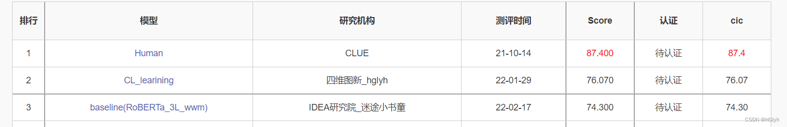

# little_dinosaur

针对中文nlp任务数据集 实现工具自动检测noisy label 

  
# 环境

tensorflow <= 2.1.0  
keras == 2.3.1  
bert4keras  
fairies  

# 数据格式

为保证工具正常使用，请参考data/中数据格式 需要保证每条数据都是一个字典 且字典中包含"label"和"sentence"等关键字段  

分类任务 {"id": 2214, "label": "2", "sentence": "我退货申请撤销 一下吧"}    
句对任务 {"id": 2214, "label": "2", "sentence_1": "我退货申请撤销 一下吧", "sentence_2": "好的  谢谢，希望进完发货"}

# 使用

首先通过修改model.conf文件 配置超参数

```python

# 你可以使用下面代码快速寻找错误标签

import fairies as fa
from model_utils import data_utils
from main import *
data = fa.read("data/example.json")
data = data_utils.convert_data_to_train(data)
model_save_name = "model/test.weights"
find_noisy_label_drop(data,
                      model_save_name,
                      isPair=False,
                      times=2,
                      isDrop_noisy=True)


#  你可以使用下面的方式快速微调和预测

import fairies as fa
from model_utils import data_utils
from main import *
data = fa.read("data/example.json")
data = data_utils.convert_data_to_train(data)
model_save_name = "model/test.weights"
train_classification_model(data, model_save_name)
res = predict_classification_model(data, data, model_save_name)

```

# 效果

榜单地址 https://www.cluebenchmarks.com/dcrank.html



## FAQ

1. **检测noisy label的原理**  
在较大的学习率下 noisy label不会快速收敛 挑选loss较大的样本做为可疑样本  
通过多模型投票 挑选出noisy label  

2. **为什么使用electra-small做为预训练模型**  
主要是因为性能原因 如果有条件 可以使用更大的预训练模型 可以获得更好的效果  

# 参考论文  
Confident Learning: Estimating Uncertainty in Dataset Labels  
Improving Generalization by Controlling Label-Noise Information in Neural Network Weights  
Unsupervised Data Augmentation for Consistency Training  
DivideMix: Learning with Noisy Labels as Semi-supervised Learning  
Training Deep Neural Networks on Noisy Labels with Bootstrapping  